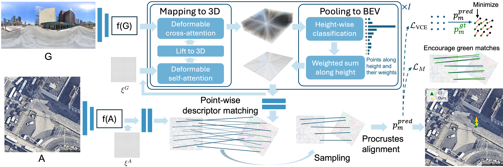

# [CVPR'25] FG²: Fine-Grained Cross-View Localization by Fine-Grained Feature Matching
[[`Arxiv`](https://arxiv.org/abs/2503.18725)][[`Poster`](https://drive.google.com/file/d/1lEj-oQXmnDtGhsJGH4HzwONJudt3YLP2/view?usp=sharing)][[`Video`](https://www.youtube.com/watch?v=GStVKsoLDl4)][[`BibTeX`](#citation)]




## 📝 Abstract
We propose a novel fine-grained cross-view localization method that estimates the 3 Degrees of Freedom pose of a ground-level image in an aerial image of the surroundings by matching fine-grained features between the two images. The pose is estimated by aligning a point plane generated from the ground image with a point plane sampled from the aerial image. To generate the ground points, we first map ground image features to a 3D point cloud. Our method then learns to select features along the height dimension to pool the 3D points to a Bird’s-Eye-View (BEV) plane. This selection enables us to trace which feature in the ground image contributes to the BEV representation. Next, we sample a set of sparse matches from computed point correspondences between the two point planes and compute their relative pose using Procrustes alignment. Compared to the previous state-of-the-art, our method reduces the mean localization error by 28% on the VIGOR cross-area test set. Qualitative results show that our method learns semantically consistent matches across ground and aerial view through weakly supervised learning from the camera pose.

## 📦 Checkpoints
📁 [**Download pretrained models**](https://drive.google.com/drive/folders/1WUViQcX9m0PE9FePbWklisBS88sHOyMK?usp=sharing)

## ⚙️ Setup

```bash
git clone https://github.com/vita-epfl/FG2.git
cd FG2
conda env create -f environment.yml
conda activate fg2
mim install "mmcv-full>=1.7.1"
```

If you encounter errors related to NumPy 2.x, run:

```bash
pip install "numpy<2"
```

---


## 📊 Evaluation

Run evaluation on the **same-area** test set with known orientation (use `--area crossarea` if you wish to evaluate on **cross-area** test set):

```bash
python vigor_eval.py --area samearea -b 24 --random_orientation False --ransac False
```

### 🧭 RANSAC Option

To enable robust pose estimation with RANSAC:

```bash
--ransac True
```

### 🔄 Evaluate with Unknown Orientation (Two-Stage Inference)

**First run** – predict orientation:

```bash
python vigor_eval.py --area samearea -b 24 --random_orientation True --first_run True
```

**Second run** – apply predicted orientation for pose estimation:

```bash
python vigor_eval.py --area samearea -b 24 --random_orientation True --first_run False
```

### 🔍 Visualize Matched Cross-View Correspondences
--idx 0: Selects the sample index. Replace 0 with the index you want to visualize.
```bash
python vigor_qualitative_results.py --area samearea --idx 0
```

📌 **Note:** Ensure dataset paths are correctly set in `config.ini`.

---

## 🚀 Training

**Knwon orientation**:

Training on the **same-area** training set with known orientation (use `--area crossarea` if you wish to train on **cross-area** training set):

```bash
python vigor_train.py --area samearea -b 24 --random_orientation False 
```

**Unknwon orientation**:

📌 **Note:** If you wish to train a model to estimate orientation first (see details about two-step inference in our paper), use a large `beta` value, for example, `beta=100` in `config.ini`.

```bash
python vigor_train.py --area samearea -b 24 --random_orientation True 
```

## 🚗 KITTI  
**Evaluation Results Updated**: We have revised our evaluation on the KITTI dataset. The updated results differ slightly from the CVPR version. A new ArXiv submission reflecting these changes will be available soon.

| Setting       | Version     | Loc. Mean ↓ (m) | Loc. Median ↓ (m) | Lateral R@1m ↑ (%) | Lateral R@5m ↑ (%) | Long. R@1m ↑ (%) | Long. R@5m ↑ (%) | Orien. Mean ↓ (°) | Orien. Median ↓ (°) | Orien. R@1° ↑ (%) | Orien. R@5° ↑ (%) |
|---------------|-------------|------------------|--------------------|---------------------|---------------------|-------------------|-------------------|---------------------|-----------------------|---------------------|---------------------|
| Same-Area     | CVPR        | 0.75             | 0.52               | 99.73               | 100.00              | 86.99             | 98.75             | 1.28                | 0.74                  | 61.17               | 95.65               |
| Same-Area     | Updated     | 0.74             | 0.51               | 95.84               | 99.66               | 92.74             | 99.05             | 0.93                | 0.67                  | 67.43               | 98.86               |
| Cross-Area    | CVPR        | 7.45             | 4.03               | 89.46               | 99.80               | 12.42             | 55.73             | 3.33                | 1.88                  | 30.34               | 81.17               |
| Cross-Area    | Updated     | 7.20             | 4.10               | 38.44               | 85.84               | 22.28             | 61.24            | 3.61                | 2.37                  | 22.89               | 77.84               |

**Training:**
```bash
python kitti_train_test.py -b 24 -t train
```
**Test:**
```bash
python kitti_train_test.py -b 24 -t test
```


## ✅ To-Do

- [x] Initial repo structure
- [x] Evaluation pipeline
- [x] Pretrained checkpoints
- [x] Training scripts
- [x] Visualization tools

---

## Acknowledgements

The implementation of Procrustes analysis and RANSAC for 3DoF pose estimation in this project is adapted from the 6DoF pose estimation framework provided by [Mickey](https://nianticlabs.github.io/mickey/).  
Many thanks to the authors for their outstanding work and for sharing it with the community!

## Citation
```bibtex
@article{xia2025fg,
  title={FG\textsuperscript{2}: Fine-Grained Cross-View Localization by Fine-Grained Feature Matching},
  author={Xia, Zimin and Alahi, Alexandre},
  journal={arXiv preprint arXiv:2503.18725},
  year={2025}
}
```
